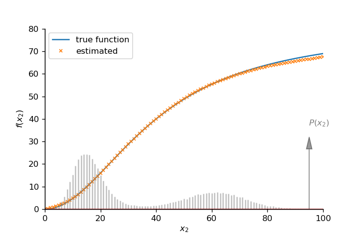

# Quantifying biochemical reaction rates from static populationvariability within incompletely observed complex networks

Supplementary Code for the PLOS Computational Biology publication: https://doi.org/10.1371/journal.pcbi.1010183


## Code and Data

### Simulation Code: 
C++ code to simulate the four different systems introduced in Figure 2 of the main paper. The minimum number for each reaction to occur, the starting conditions as well as all function parameters need to be given as arguments.

In the original version of the simulation code which was also used in the paper there was a mistake leading to the simulation stopping earlier than expected. Instead of sampling each reaction N number of times, it stopped as soon as one single reaction reached N occurences. However, we found no significant deviations for out data in most cases, only in some specific scenarios using the corrected simulation code lead to slight improved inference quality.

* `Bistable_sim.cpp`
* `Oscillating_sim.cpp`
* `Noisecontrol_sim.cpp`
* `Noiseenhance_sim.cpp`

### Data: 

Example output files (only joint probability distributions) of the four different systems used in Figure 2 of the main text.

* `Bistable_BC_file.txt`
* `Oscillating_BC_file.txt`
* `Noisecontrol_BC_file.txt`
* `Noiseenhance_BC_file.txt`

### Analysis Code:

#### Sampling Distributions

`Distribution_Sampling.py`: Python code containing all functions used to sample distributions from an underlying 'true' distribution.


* `Sample_Dist`: Function to sample *N* independent points from a two dimensional distribution *P_joint*.
* `Sample_Dist_error_bin`: Adding binominal error with a chance of probability *p* for each molecule to get detected.
* `Sample_Dist_error_abs`: Adding an absolute error on each data point with a standard deviation of *sig_abs*, negative molecule numbers get ignored.
* `Sample_Dist_error_rel`: Adding an error on each data point relative to the molecule number with a standard deviation of *sig_rel* (fraction of the molecule number).
* `Sample_Dist_error_both`: Adding both an absolute error and a relative error to each data point.
    
    
#### Inferring reaction rates    
    
`Rate_Inference.py`: Python code containing all functions for the rate inference algorithm. The convex optimization method used in here is a modified version based on the Python implementation of the Matlab function lsqlin described in here: (http://maggotroot.blogspot.com/2013/11/constrained-linear-least-squares-in.html).
The following functions can be used to infer reaction rates from given data:

* `Rate_Inference_main`: Function infering reaction rates, needs joint probability distribution and regularization parameter as arguments (the lifetime of the affected variable can also be specified).
* `Rate_Inference_Monotonicity`: Adding a further monotonicity constraint as either *'pos'* or *'neg'*.
* `Rate_Inference_Dimerization`: Code for the different system where the variable degrades via dimerization (Figure 5 of the main text).
* `Rate_Inference_Cross_Validation`: Compares the normal rate inference against a constant rate and determines which one has the smallest Error, needs two seperate joint probability distributions as two halfs of a data set but returns the inference for the full set.


## Quick Example Code:

Quick example code to infer reaction rates from simulation data (if using your own data skip step 2).

1.First import all necessary functions:

```ruby
import numpy as np
import Distribution_Sampling
import Rate_Inference
import matplotlib.pyplot as plt
%matplotlib inline
```


2.Take a sample from the underlying distribution obtained. We use the data from the Bistable simulation from Figure 2 in the main text here. This step is done only when using simulation data to simulate a limited number of independent experimental samples.

```ruby
P_joint_full = np.loadtxt('Simulation/Data/Bistable_BC_file.txt')
P_joint_full = P_joint_full/sum(sum(P_joint_full))

P_sampled = Distribution_Sampling.Sample_Dist(P_joint_full, N = 100000)
```


3.Using *P_sampled* as our input data for the joint probability distribution matrix (downstream variable in rows, upstream variable in columns), we can use our optimization algorithm to infer the reaction rate. As described in the paper we can use $1/\sqrt N$ ($N$ as the number of independent samples) as a guess for the regularization parameter.

```ruby
f_estimated = Rate_Inference.Rate_Inference_main(P_sampled, reg_param = 1/100000**0.5, tau = 1)
```

4.Data visualization:

```ruby
f_true = lambda x: 80*x**2/(x**2+40**2) #define true function for plotting
P_upstream = sum(P_sampled.T) #upstram distribution used for visualization of available data

fig,ax = plt.subplots(dpi = 120)
ax.plot(np.arange(0,len(P_upstream)),f_true(np.arange(0,len(P_upstream))), label = 'true function')
ax.plot(np.arange(0,len(P_upstream)),f_estimated, linestyle = '', marker = 'x', markersize = 4, label = 'estimated')
ax.set_ylim(0,80);
ax.set_xlim(0,100);
ax.set_xlabel(r"$x_2$")
ax.set_ylabel(r"$f(x_2)$")
ax.spines['right'].set_visible(False)
ax.spines['top'].set_visible(False)
axp = ax.twinx()
markerline, stemline, baseline, = axp.stem(np.arange(0,len(P_upstream)),P_upstream,
                                             markerfmt = 'grey',linefmt = 'grey', use_line_collection = True)
plt.setp(markerline, marker = '',markersize = 7, linestyle = '')
plt.setp(stemline, alpha = 0.5)
axp.set_ylim(0,0.09);
axp.set_ylim(0,0.15)
axp.set_yticks([])
axp.set_ylabel(r"$P(x_2)$", rotation = 0, labelpad = -5, color = 'grey')
axp.spines['right'].set_visible(False)
axp.spines['top'].set_visible(False)
axp.arrow(95,0,0,0.05, head_width=2, head_length=0.01, fc='k', ec='k', color = 'grey', alpha = 0.4)
ax.legend(loc = 'best');
```



### Contacts
If you have any questions or comments, please feel free to email Timon Wittenstein (timon.wittenstein@mail.utoronto.ca).
